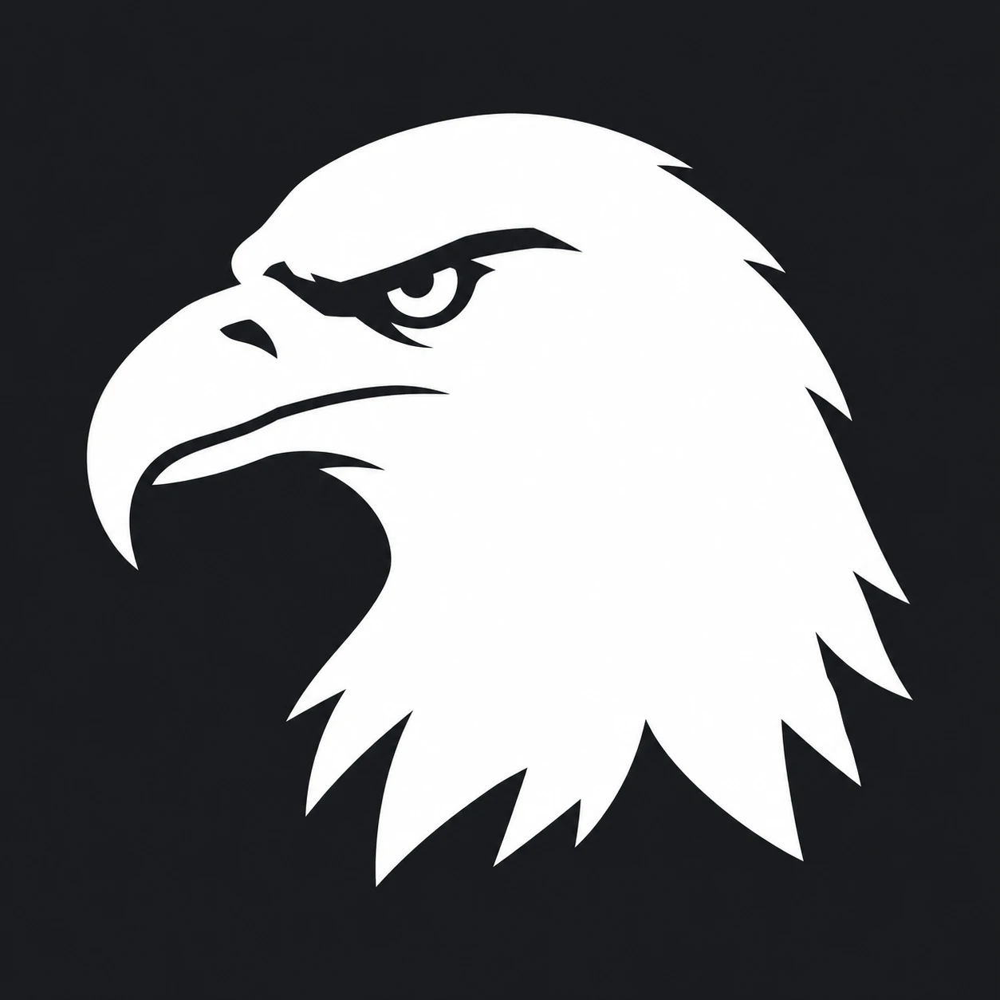

# Aetos Websites — brand

**White on black (Charcoal `#1A1C20`), with an Eagle Gold accent.** Premium, trustworthy, calm. The main theme is the
logo's: white on Charcoal. Everything else is mostly neutral, and gold is used sparingly, only for buttons and highlights.

## Logo (final)



`docs/brand/aetos-logo.png`: a white bald-eagle head on Charcoal `#1A1C20` (1254×1254). This is the logo; don't redraw it.
Earlier concepts that weren't chosen are in `docs/brand/concepts/`.

## Colour palette

| Role | Name | Hex | RGB | Use |
| --- | --- | --- | --- | --- |
| Main | Charcoal | `#1A1C20` | 26, 28, 32 | Headings, logo background, dark sections, footer |
| Logo | White | `#FFFFFF` | 255, 255, 255 | The eagle and wordmark on Charcoal |
| Secondary | Graphite | `#2E3135` | 46, 49, 53 | Cards and panels on dark sections |
| Background | Marble | `#F6F4EF` | 246, 244, 239 | Page background (warm white, easier on the eye than pure white) |
| Line | Stone | `#D9D4CA` | 217, 212, 202 | Borders, dividers |
| Body text | Slate | `#5C6066` | 92, 96, 102 | Paragraph text on Marble |
| Accent | Eagle Gold | `#C9A13B` | 201, 161, 59 | Buttons, highlights: on Charcoal, or as a button with Charcoal text |
| Accent text | Deep Gold | `#7A5C14` | 122, 92, 20 | Gold-coloured text or links on Marble |

### Contrast (checked against WCAG)

| Pair | Ratio | OK for |
| --- | --- | --- |
| White on Charcoal | 17.1 : 1 | Logo, wordmark, all text on dark sections |
| Charcoal on Marble | 15.5 : 1 | All text |
| Eagle Gold on Charcoal | 7.0 : 1 | All text, gold buttons with Charcoal text |
| Slate on Marble | 5.8 : 1 | Body text |
| Deep Gold on Marble | 5.7 : 1 | Links, gold text on light backgrounds |
| Eagle Gold on Marble | 2.2 : 1 | **Never use for text.** Decoration only (lines, icons next to a label) |

## Rules

- **70 / 25 / 5:** about 70% Charcoal, White or Marble, 25% Slate and Stone, 5% Gold. The less gold, the more expensive it looks.
- **Gold means "click here" or "this matters".** It isn't used for decoration.
- **One font: Inter.** Body is Regular 400. Headings are Bold 700.
- **Wordmark:** "AETOS" in capitals, Bold or ExtraBold, letter-spacing +8 to +12%: White on Charcoal, or Charcoal on Marble. Optionally add "WEBSITES" underneath, smaller, with wide spacing (Stone on Charcoal, Slate on Marble).
- **Logo:** a white bald-eagle head (realistic silhouette, detail made with Charcoal cut-outs) on Charcoal, beside a white wordmark. On light backgrounds: the Charcoal eagle on Marble. Gold is never in the logo: it stays the accent colour for buttons and highlights.
- **Scope:** this is Aetos's own brand (website, emails, invoices, Stripe checkout, Control Room). Client demo sites get their own colours per trade.

## CSS tokens

```css
:root {
  --charcoal: #1A1C20;
  --white:    #FFFFFF;
  --graphite: #2E3135;
  --marble:   #F6F4EF;
  --stone:    #D9D4CA;
  --slate:    #5C6066;
  --gold:     #C9A13B;
  --gold-text:#7A5C14;
}
```

## Stripe checkout (Settings → Branding)

- Brand colour: `#1A1C20`
- Accent colour: `#C9A13B`
- Icon and logo: the white eagle on Charcoal
